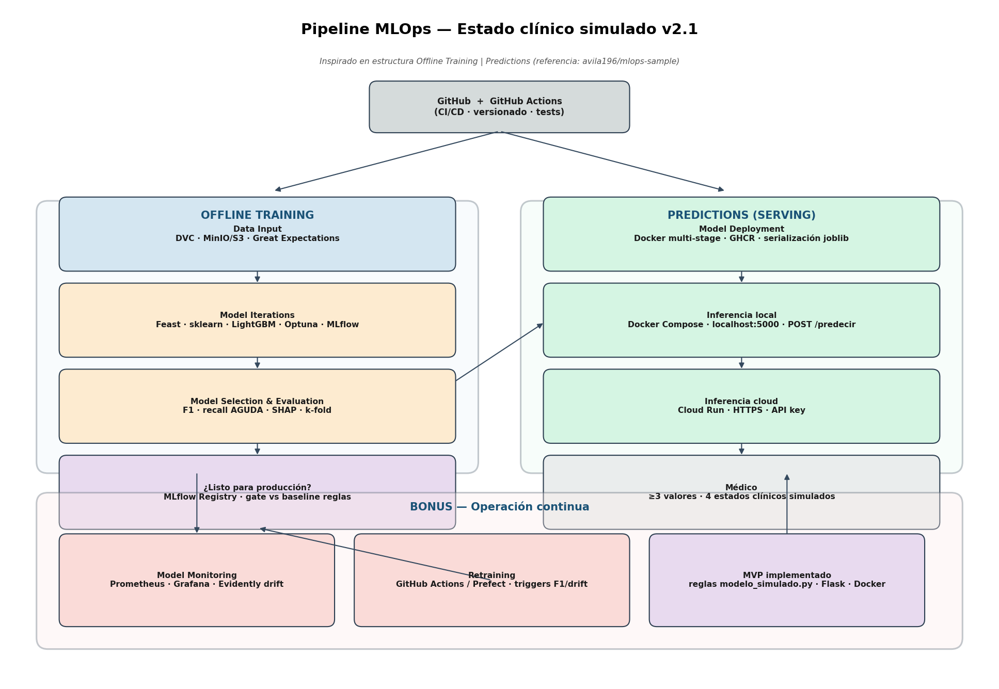

# Propuesta de pipeline MLOps — Estado clínico simulado v2.1

**Proyecto:** 2MLops (Unidad 3) · **Rama:** `unidad3`  
**Referencia de estructura:** [avila196/mlops-sample](https://github.com/avila196/mlops-sample) (Offline Training | Predictions)  
**Alcance:** documentación ejecutable por un equipo ML; trabajo académico.

---

## Case Challenge

### Background

En un entorno clínico **simulado**, un servicio debe ayudar a clasificar el estado orientativo de un paciente en **cuatro categorías** a partir de signos medibles (presión arterial, colesterol, glucosa, hábitos). El objetivo del ejercicio MLOps es diseñar un pipeline que permita a un equipo de ML **entrenar, versionar, desplegar, monitorizar y reentrenar** un modelo de forma reproducible, mientras el médico puede usar la solución **en su PC local** o **mediante peticiones a un servicio en la nube**.

Los datos de referencia (~70 000 registros tabulares) están en `data/`; el **MVP ya implementado** expone reglas deterministas vía Flask/Docker (`servicio_estado_clinico/`).

### Problem definition

#### Model training

El modelo se entrena **offline** por un ML engineer (o de forma automatizada vía CI).

- **Dataset:** CSV en `data/raw/` y versiones procesadas en `data/processed/` (incluye columna `categoria_clinica` generada por `scripts/ajustar_cuatro_categorias.py`).
- **Procesamiento:** limpieza, validación de calidad, feature engineering y etiquetado en cuatro clases.
- **Selección y evaluación** son etapas separadas para comparar modelos con métricas comparables (F1 macro, recall por clase, especialmente **AGUDA ~1,9 %**).
- **Producción objetivo:** **LightGBM** + Pipeline sklearn, registrado en **MLflow Model Registry**.
- **Baseline MVP:** reglas en `modelo_simulado.py` — no se promueve ML sin superar este baseline en test.

#### Prediction task

El **médico** introduce **al menos tres valores** y recibe **exactamente una** etiqueta:

`NO ENFERMO` · `ENFERMEDAD LEVE` · `ENFERMEDAD AGUDA` · `ENFERMEDAD CRÓNICA`

| Modo | Tecnología | Acceso |
|------|------------|--------|
| **Local** | Docker Compose + contenedor API | `http://localhost:5000/predecir` |
| **Remoto** | Cloud Run / App Runner + TLS | `https://.../predecir` + API key |

**Requisito de latencia:** inferencia CPU **<100 ms** tras warm-up; modelo tabular **<10 MB** (sin GPU).

---

## Part 1: Machine Learning Pipeline Design

Según los requisitos del problema, se propone el siguiente diagrama (estructura **Offline Training | Predictions**, al estilo mlops-sample):



Las secciones siguientes detallan cada bloque del diagrama. La numeración **0–12** (apéndice al final) desglosa las mismas etapas para auditoría técnica.

> **Nota:** Python se asume en todas las etapas que requieran código, salvo que se indique otra tecnología.

---

### Offline Training

El entrenamiento offline comienza en **GitHub + GitHub Actions**: versionado de código, tests, quality gates de datos y pipelines de entrenamiento/despliegue. Es el punto de partida de cualquier iteración del modelo, igual que en [mlops-sample](https://github.com/avila196/mlops-sample).

---

#### Data Input

**Objetivo:** ingerir y versionar datos con trazabilidad reproducible.

| Aspecto | Detalle |
|---------|---------|
| **Suposiciones** | Volumen ~70k filas cabe en DVC + object storage; no hay millones de archivos como en fintech. **Si falla:** solo Git + CSV en repo. |
| **Tecnologías** | **Git** (metadatos), **DVC** (blobs), **MinIO** local / **S3** cloud. **Descartado:** Redshift (overkill). |
| **Proceso** | `dvc add data/` → remote → tag `data@vN`. Great Expectations en CI antes de train. |
| **Artefacto** | Snapshot `data@vN` con hash. |
| **Repo hoy** | CSV en `data/raw/`, `data/processed/` — **DVC propuesto**. |

**Suposiciones explícitas:**

- Los CSV son representativos del dominio académico, no de una población clínica real (S1).
- Columnas y rangos documentados en catálogo (etapa 2 del apéndice).

---

#### Model Iterations

**Objetivo:** explorar datos, definir features y entrenar candidatos con experimentos trazables.

| Aspecto | Detalle |
|---------|---------|
| **Suposiciones** | Seis features tabulares bastan; LightGBM en CPU es suficiente. |
| **Tecnologías** | **pandas**, **Jupyter** (EDA), **sklearn Pipeline** + **Feast** (offline), **LightGBM**, **Optuna**, **MLflow Tracking**. **Descartado:** deep learning (sin GPU/necesidad). |
| **Proceso** | EDA → features → split 70/15/15 estratificado → Optuna → log runs. |
| **Artefacto** | Runs MLflow con params, metrics, `.pkl`. |
| **Repo hoy** | Etiquetado con reglas en script — **ML iterativo propuesto**. |

**Enfermedades huérfanas / desbalance:** clase AGUDA minoritaria; usar `class_weight`, estratificación y prioridad de reglas en baseline.

---

#### Model selection & evaluation

**Objetivo:** comparar modelos y aprobar candidato con evidencia.

| Aspecto | Detalle |
|---------|---------|
| **Suposiciones** | F1 macro + recall AGUDA son más importantes que accuracy global. |
| **Tecnologías** | **MLflow** (comparación), **SHAP** (explicabilidad), **k-fold** estratificado. **Descartado:** solo accuracy. |
| **Proceso** | Matriz confusión, SHAP summary, comparación vs **baseline reglas** en mismo test. |
| **Gate humano** | Aprobador registra decisión en MLflow antes de promover. |
| **Criterio** | F1 macro **y** recall AGUDA ≥ baseline reglas. |

---

#### ¿Es momento de pasar a producción?

El modelo candidato debe cumplir criterios mínimos de calidad, latencia (<100 ms) y tamaño (<10 MB). Si **sí** → se entrega al engineer de despliegue vía **MLflow Registry** (Staging → Production). Si **no** → vuelta a Model Iterations.

| Gate | Umbral |
|------|--------|
| F1 macro test | ≥ baseline reglas |
| Recall AGUDA test | ≥ baseline reglas |
| Inferencia CPU | p95 <100 ms en contenedor |
| Explicabilidad | Informe SHAP archivado |

---

### Predictions (Serving)

El modelo (o el MVP baseline) se empaqueta y expone para inferencia en tiempo casi real.

---

#### Model deployment

| Aspecto | Detalle |
|---------|---------|
| **Suposiciones** | Un contenedor sirve el modelo serializado (joblib/pickle dentro de Pipeline sklearn). |
| **Tecnologías** | **Docker** multi-stage, **GHCR**, serialización joblib. **Descartado:** EMR+Spark (mlops-sample usa Spark para millones de archivos batch; aquí inferencia unitaria por médico). |
| **Proceso** | Export Production desde MLflow → build imagen → push GHCR. |
| **Contrato API** | `POST /predecir` — JSON igual al MVP actual. |

---

#### Inferencia en tiempo real (local + cloud)

A diferencia del caso fintech del sample (batch diario masivo), aquí la predicción es **por consulta del médico** (<1 s), alineado con la **Part 3** del sample (real-time):

| Vía | Stack | Usuario |
|-----|-------|---------|
| **Local** | Docker Compose, `localhost:5000` | Médico sin dependencia de internet |
| **Cloud** | Cloud Run / App Runner, HTTPS, API key | Médico remoto o dispositivo sin Docker |

**Suposiciones:** misma imagen en ambos modos; TLS en cloud; no persistir PII en logs (S5).

**Repo hoy:** Flask + `docker run -p 5000:5000` — **Compose y Cloud propuestos**.

---

### Bonus #1 — Model Monitoring

Aunque no sea obligatorio en la consigna mínima, el monitoreo es crítico en MLOps maduro (como indica mlops-sample):

- **Prometheus + Grafana:** latencia, errores 4xx/5xx, peticiones/min.
- **Evidently AI:** data drift en presión, glucosa, colesterol; alerta si frecuencia AGUDA ∉ [1%, 3%].
- **Logs JSON** sin valores identificables.

---

### Bonus #2 — Retraining y mejora continua

Triggers de reentrenamiento (GitHub Actions scheduled o Prefect):

1. ≥5 000 registros nuevos en DVC.
2. Drift Evidently > umbral.
3. Caída F1 online >10 %.
4. Calendario trimestral + aprobación manual.

Rollback: MLflow Registry → redeploy imagen anterior en GHCR/Cloud Run.

---

## Part 2: Implementación de un componente del pipeline (MVP)

Del pipeline completo, se eligió implementar el componente de **inferencia en tiempo real simplificado**, equivalente al “model container” del sample:

**Suposiciones y simplificaciones** (como en mlops-sample Part 2):

| Simplificación | Justificación |
|----------------|---------------|
| Reglas deterministas en lugar de LightGBM entrenado | Consigna académica Unidad 1; baseline auditable |
| Flask sin Swagger | Formulario web + JSON suficiente para evaluación |
| Docker single-container | Sin Airflow/Compose en MVP (propuesto en Part 1 para prod) |
| Sin MLflow en runtime | Registry documentado como objetivo prod |

**Qué está en el repo:**

| Archivo | Rol |
|---------|-----|
| `servicio_estado_clinico/modelo_simulado.py` | Lógica baseline 4 categorías |
| `servicio_estado_clinico/app.py` | Flask `POST /predecir` |
| `servicio_estado_clinico/Dockerfile` | Imagen reproducible |
| `scripts/ajustar_cuatro_categorias.py` | Etiquetado offline alineado a reglas |

**Cómo ejecutar el MVP:**

```powershell
cd servicio_estado_clinico
docker build -t estado-clinico-demo .
docker run --rm -p 5000:5000 estado-clinico-demo
```

Abrir `http://localhost:5000/` o `POST http://localhost:5000/predecir`.

---

## Part 3: Diseño ante requisitos futuros del pipeline

*(Adaptado de mlops-sample Part 3 al dominio clínico simulado.)*

### Predicciones en tiempo real (<1 s)

Ya cubierto: contenedor Docker + Flask/FastAPI. Evolución: **FastAPI** + OpenAPI; hosting en **Cloud Run** o ECS.

### Reentrenamiento periódico con feedback

- CI/CD existente (GitHub Actions) reentrena y despliega tras gate.
- Retro-scoring del CSV histórico con nuevo modelo para comparar vs baseline.
- Dashboard Streamlit/Grafana para stakeholders académicos.
- Endpoint opcional `/retrain` solo en staging (nunca prod sin gate).

### Múltiples versiones de modelo self-served

- MLflow Registry mantiene N versiones; Cloud Run traffic split o tags de imagen (`:v1`, `:v2`).
- GitHub Actions promueve versión aprobada; rollback documentado en CHANGELOG operativo.

---

## Apéndice A — Registro maestro de suposiciones (S1–S8)

| ID | Suposición | Implicación si falla | Validación |
|----|------------|----------------------|------------|
| S1 | CSV ~70k filas, dominio académico | Sesgo | EDA + Evidently |
| S2 | Cuatro categorías suficientes | Diagnósticos finos no cubiertos | Alcance + revisión humana |
| S3 | Inferencia <100 ms, modelo <10 MB | UX degradada en local | Benchmark contenedor |
| S4 | Docker local **o** HTTPS cloud | Médico no puede usar servicio | Modo alternativo documentado |
| S5 | Sin PII en logs | Privacidad | Logs JSON redactados |
| S6 | AGUDA ~1,9 % | Ignorar minoría | Estratificación + recall gate |
| S7 | Reglas alineadas a CSV | Desalineación | Tests paridad |
| S8 | Free tier cloud aceptable | Solo local | Fallback documentado |

---

## Apéndice B — Detalle técnico por etapa (0–12)

Cada etapa sigue: **Objetivo · Suposiciones · I/O · Tecnologías · Proceso · Criterios · Riesgos · Repo**.

| # | Etapa | Tecnología clave | Repo |
|---|--------|------------------|------|
| 0 | Encuadre | Markdown, RACI | README, docs |
| 1 | Ingesta | Git, DVC, S3/MinIO | `data/` ✓ |
| 2 | Catálogo | DVC linaje, OpenMetadata opt. | propuesto |
| 3 | Calidad | Great Expectations, Pandera | propuesto |
| 4 | Features | pandas, sklearn, Feast | propuesto |
| 5 | Train | LightGBM, Optuna, MLflow | propuesto |
| 6 | Eval | SHAP, k-fold, gate | propuesto |
| 7 | Registry | MLflow Staging→Prod | propuesto |
| 8 | Package | Docker, GHCR | Dockerfile ✓ |
| 9 | Deploy local | Docker Compose | `docker run` ✓ |
| 10 | Deploy cloud | Cloud Run, API key | propuesto |
| 11 | Monitor | Prometheus, Grafana, Evidently | propuesto |
| 12 | Retrain | GitHub Actions, Prefect | propuesto |

Diagramas complementarios: [`diagrama_pipeline_e2e.png`](diagrama_pipeline_e2e.png), [`diagrama_despliegue_hibrido.png`](diagrama_despliegue_hibrido.png), [`diagrama_cicd_mlops.png`](diagrama_cicd_mlops.png), [`diagrama_datos_ml.png`](diagrama_datos_ml.png).

---

## Apéndice C — Enfermedades huérfanas

**Desbalance (AGUDA ~1,9 %):** estratificación, `class_weight`, recall como gate, monitoreo de frecuencia en prod.

**Patologías raras no en CSV:** no se diagnostican por nombre; flag `requiere_revision_humana`; cuarentena `raw/quarantine/`.

---

## Apéndice D — Plan de puesta en marcha

| Fase | Semanas | Entregable |
|------|---------|------------|
| 0 Baseline | 1 | MVP Flask/Docker (**hecho**) |
| 1 Datos | 1–2 | DVC, GX, catálogo |
| 2 ML | 2 | LightGBM + MLflow + SHAP |
| 3 Deploy | 1 | GHCR, Compose, Cloud Run |
| 4 Ops | 1 | Grafana, Evidently, retrain CI |

---

## Referencias

- Repo ejemplo estructura: [github.com/avila196/mlops-sample](https://github.com/avila196/mlops-sample)
- Cambios vs Semana 1: [`CHANGELOG.md`](CHANGELOG.md)
- Regenerar PDF: `python docs/generar_pdf_pipeline_mlops.py`

---

*Documento académico v2.1 — no constituye asesoría clínica.*
