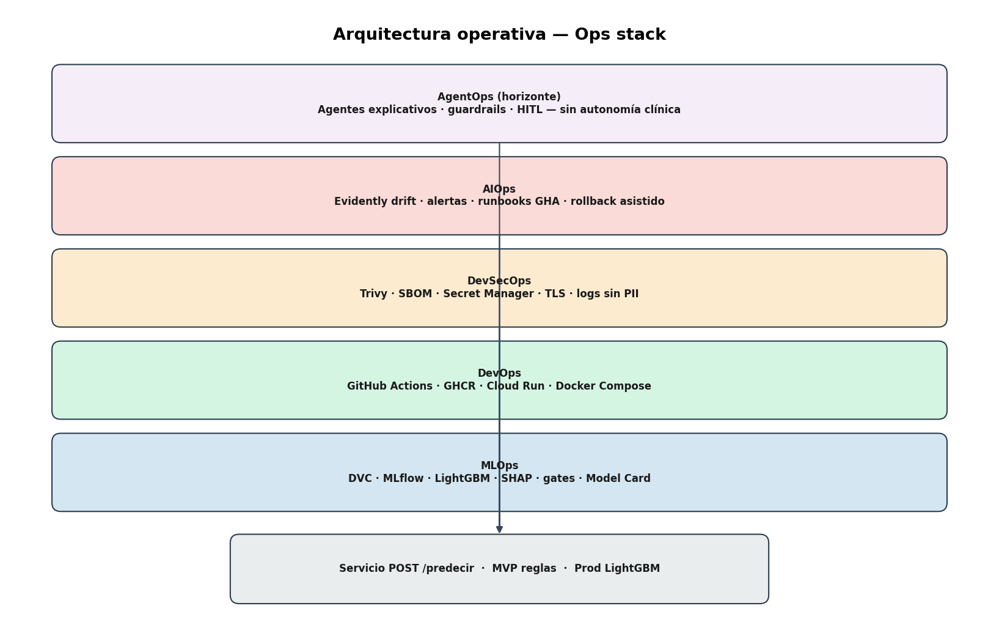

# Propuesta de pipeline MLOps — Estado clínico simulado

**Versión:** 3.0 · **Rama:** `unidad3`  
**Nivel:** propuesta ejecutable (posgrado / operación ML profesional)  
**Alcance:** documentación; MVP de inferencia implementado; stack completo planificado.

---

## Resumen ejecutivo

Se propone un **sistema sociotécnico** de clasificación orientativa en cuatro estados clínicos simulados, gobernado por principios de **MLOps**, **DevOps**, **DevSecOps**, **AIOps** y horizonte **AgentOps**, con despliegue **edge (local)** y **cloud**.

| Capa | Rol en este proyecto |
|------|----------------------|
| **MLOps** | Datos versionados, entrenamiento trazable, registry, evaluación, retrain |
| **DevOps** | CI/CD GitHub Actions, contenedores inmutables, IaC ligero |
| **DevSecOps** | SBOM, escaneo de imagen, secretos, TLS, mínima PII |
| **AIOps** | Alertas sobre métricas/drift, runbooks automatizados, rollback asistido |
| **AgentOps** | *Futuro:* agente de soporte al médico (explicación SHAP, triage documental), sin autonomía clínica |

**Implementado hoy:** baseline de reglas + Flask + Docker (`servicio_estado_clinico/`).  
**Objetivo de producción:** LightGBM en MLflow, misma API, despliegue híbrido.

Documentos complementarios: [`MODEL_CARD.md`](MODEL_CARD.md), [`ADR/`](ADR/), [`CHANGELOG.md`](CHANGELOG.md).

---

## 1. Marco de referencia y madurez

### 1.1 Alineación CD4ML / Google MLOps

| Nivel | Capacidad | Estado propuesta |
|-------|-----------|------------------|
| L0 | Manual, scripts ad hoc | Semana 1 (superado) |
| L1 | Pipeline reproducible | MVP Docker + reglas |
| L2 | CI/CD automatizado | GitHub Actions (planificado) |
| L3 | Deploy automatizado + monitoreo | Cloud Run + Prometheus/Evidently |
| L4 | Retrain continuo con gates | Workflows programados + MLflow |

### 1.2 Diagrama principal del pipeline

Estructura **Offline Training | Predictions** ([referencia mlops-sample](https://github.com/avila196/mlops-sample)):


### 1.3 Diagrama de capas operativas (Ops stack)



---

## 2. Case Challenge

### 2.1 Background

Servicio de **triaje simulado**: el médico ingresa ≥3 signos (presión, colesterol, glucosa, hábitos, antecedentes) y obtiene una de cuatro etiquetas. El reto es operacionalizar el ciclo de vida ML con trazabilidad, no solo acertar una predicción puntual.

**Datos:** ~70 000 filas en `data/` · **MVP:** `modelo_simulado.py`.

### 2.2 Problem definition

#### Entrenamiento offline (ML engineer)

Pipeline batch: ingesta → validación → features → LightGBM + Optuna → evaluación SHAP → MLflow Registry. Baseline de reglas como **champion** hasta que ML supere métricas en hold-out ([ADR-001](ADR/001-baseline-reglas-vs-lightgbm.md)).

#### Inferencia online (médico)

| Modo | Stack | SLO latencia p95 |
|------|-------|------------------|
| Edge | Docker Compose, `localhost:5000` | <100 ms |
| Cloud | Cloud Run + API key + TLS | <300 ms (incl. red) |

Contrato único: `POST /predecir` (JSON documentado en README del servicio).

---

## 3. Part 1 — Diseño del pipeline ML

> Python en todas las etapas salvo indicación contraria. Cada bloque incluye **suposiciones**, **tecnología elegida**, **alternativa descartada** y **artefacto**.

### 3.1 Punto de partida: GitHub + GitHub Actions

**Por qué:** single source of truth para código, pipelines, tests y políticas de rama (`main` protegida, PR obligatorio para prod).

**DevOps:** workflows `lint-test`, `data-quality`, `train`, `build-push`, `deploy-staging`, `deploy-prod` ([diagrama CI/CD](diagrama_cicd_mlops.png)).

---

### 3.2 Offline Training

#### Data Input

| | |
|-|-|
| **Suposiciones** | Volumen CSV ~50 MB; sin streaming masivo (≠ fintech batch del sample) |
| **Stack** | Git + **DVC** + MinIO/S3 |
| **Descartado** | Data lake enterprise (Delta/Iceberg) — costo/complejidad |
| **Artefacto** | `data@vN` con hash en tags MLflow |
| **Repo** | `data/raw/`, `data/processed/` ✓ |

#### Model Iterations

| | |
|-|-|
| **Stack** | pandas, Jupyter (EDA), sklearn Pipeline, **Feast** offline, **LightGBM**, **Optuna**, **MLflow Tracking** |
| **Descartado** | Redes neuronales — sin ganancia esperada en tabular pequeño |
| **Política desbalance** | Estratificación; `class_weight`; prioridad AGUDA en evaluación |

#### Model Selection & Evaluation

Métricas: **F1 macro**, **recall AGUDA**, matriz de confusión, **k-fold** estratificado, **SHAP** TreeExplainer. Gate humano documentado en MLflow antes de Staging.

#### Gate de producción

| Criterio | Umbral |
|----------|--------|
| F1 macro test | ≥ baseline reglas |
| Recall AGUDA test | ≥ baseline reglas |
| Latencia inferencia | p95 <100 ms CPU |
| Model Card | Publicado [`MODEL_CARD.md`](MODEL_CARD.md) |

Si falla → iteración. Si pasa → MLflow Production ([ADR-001](ADR/001-baseline-reglas-vs-lightgbm.md)).

---

### 3.3 Predictions (Serving)

#### Model Deployment

Docker multi-stage → **GHCR**; modelo serializado en imagen o volumen init desde MLflow. **DevSecOps:** Trivy en CI, usuario non-root, SBOM (Syft).

#### Inferencia híbrida

[ADR-002](ADR/002-despliegue-hibrido-edge-cloud.md) · [diagrama despliegue](diagrama_despliegue_hibrido.png).

**Adaptación vs mlops-sample:** el sample usa EMR+Spark para millones de archivos/día; aquí **inferencia unitaria síncrona** (<1 s) — arquitectura edge/cloud, no cluster batch.

---

### 3.4 Bonus — Monitoreo, AIOps y retrain

[ADR-003](ADR/003-observabilidad-aiops.md)

| Componente | Función |
|------------|---------|
| Prometheus + Grafana | SLI operativos (latencia, errores, RPS) |
| Evidently | Drift tabular; alerta si % AGUDA ∉ [1%,3%] |
| GitHub Actions | Retrain programado; rollback automático de imagen en staging |
| Runbooks | Playbook documentado: degradación → rollback registry → redeploy |

**Triggers retrain:** ≥5k filas DVC · drift score · F1 online −10% · trimestral + aprobación.

---

## 4. Part 2 — Componente implementado (MVP)

Equivalente al “model container” simplificado del sample ([Part 2 mlops-sample](https://github.com/avila196/mlops-sample)):

| Simplificación | Razón |
|----------------|-------|
| Reglas vs LightGBM | Consigna Unidad 1 + baseline interpretable |
| Flask sin OpenAPI completo | Suficiente para evaluación; prod → FastAPI |
| Contenedor único | Sin Airflow en MVP |

```powershell
cd servicio_estado_clinico
docker build -t estado-clinico-demo .
docker run --rm -p 5000:5000 estado-clinico-demo
```

---

## 5. Part 3 — Escenarios futuros

### 5.1 Tiempo real (<1 s)

Contenedor + FastAPI/OpenAPI; Cloud Run min-instances=0 o 1 según SLA.

### 5.2 Retrain con feedback clínico simulado

Retro-scoring CSV histórico; dashboard Grafana/Streamlit; endpoint `/retrain` solo staging.

### 5.3 Multi-versión y canary

Traffic split Cloud Run; tags `:vN` en GHCR; comparación A/B en MLflow.

### 5.4 AgentOps (horizonte)

**Definición:** orquestación de agentes LLM/tool-calling para **asistencia**, no decisión clínica autónoma.

| Agente (propuesto) | Herramientas | Límite |
|--------------------|--------------|--------|
| `ExplainerAgent` | SHAP values, Model Card | Solo explica predicción |
| `OpsAgent` | Consulta Grafana, abre runbook | No despliega a prod sin humano |
| `IntakeAgent` | Valida JSON vs schema | Rechaza entradas inválidas |

Stack futuro: LangGraph / OpenAI Agents SDK + guardrails + audit log. **Fuera de alcance MVP**; documentado para madurez L4+.

---

## 6. Gobernanza, seguridad y cumplimiento

### 6.1 RACI (extracto)

| Actividad | ML Eng | MLOps | Médico (usuario) | Aprobador |
|-----------|--------|-------|------------------|-----------|
| Entrenamiento | R | C | I | I |
| Promoción prod | C | R | I | A |
| Despliegue | I | R | I | C |
| Monitoreo drift | C | R | I | I |

*R=Responsible, A=Accountable, C=Consulted, I=Informed*

### 6.2 DevSecOps

- Secretos: GitHub Secrets / GCP Secret Manager (nunca en repo).
- TLS obligatorio en cloud; API key rotación semestral.
- Logs JSON sin PII; retención 30 días (académico).
- Escaneo CVE en CI; firma de imagen (cosign) en evolución.

### 6.3 Registro de suposiciones (S1–S10)

| ID | Suposición | Si falla | Validación |
|----|------------|----------|------------|
| S1 | CSV representa dominio académico | Sesgo | EDA + Evidently |
| S2 | 4 categorías suficientes | Subdiagnóstico | Alcance + humano |
| S3 | Inferencia <100 ms local | UX pobre | Benchmark |
| S4 | Edge o cloud disponible | Sin servicio | Fallback documentado |
| S5 | Sin PII en logs | Privacidad | Redacción logs |
| S6 | AGUDA ~1,9% | Sesgo mayoría | Recall gate |
| S7 | Reglas ≡ script CSV | Skew | Tests paridad |
| S8 | Free tier cloud OK | Solo edge | FinOps review |
| S9 | Sin autonomía AgentOps clínica | Riesgo ético | Guardrails + HITL |
| S10 | Equipo 2–3 FTE part-time | Retraso | Roadmap por fases |

---

## 7. SLI, SLO y error budget

| SLI | SLO (prod) | Medición |
|-----|------------|----------|
| Disponibilidad API | 99,5% mensual (académico) | Prometheus uptime |
| Latencia p95 | <100 ms edge; <300 ms cloud | Histogram |
| Tasa error 5xx | <0,5% | Counter |
| Recall AGUDA (offline eval) | ≥ baseline | MLflow test run |
| Drift score Evidently | < umbral τ | Reporte semanal |

**Error budget agotado** → congelar deploys; priorizar rollback o hotfix.

---

## 8. Enfermedades huérfanas y clases minoritarias

**Desbalance:** AGUDA ~1,9% — estratificación, pesos, recall como gate, monitoreo de tasa en prod.

**Huérfanas clínicas (no en CSV):** no inferir por nombre; respuesta conservadora + `requiere_revision_humana`; cuarentena `raw/quarantine/`.

---

## 9. Roadmap de implementación

| Fase | Sem | Entregable | Ops |
|------|-----|------------|-----|
| 0 | 1 | MVP Flask/Docker | ✓ |
| 1 | 2 | DVC, GX, catálogo | DevOps |
| 2 | 2 | LightGBM + MLflow + SHAP | MLOps |
| 3 | 1 | GHCR, Compose, Cloud Run | DevOps |
| 4 | 1 | Grafana, Evidently, AIOps runbooks | AIOps |
| 5 | 2 | AgentOps sandbox (opcional) | AgentOps |

---

## 10. Apéndice — Mapa técnico 0–12

| # | Etapa | Stack | Repo |
|---|--------|-------|------|
| 0 | Encuadre | RACI, Model Card | docs ✓ |
| 1 | Ingesta | DVC, S3 | data ✓ |
| 2 | Catálogo | DVC linaje | plan |
| 3 | Calidad | Great Expectations | plan |
| 4 | Features | Feast, sklearn | plan |
| 5 | Train | LightGBM, Optuna, MLflow | plan |
| 6 | Eval | SHAP, gates | plan |
| 7 | Registry | MLflow Prod | plan |
| 8 | Package | Docker, GHCR | Dockerfile ✓ |
| 9 | Edge | Compose | parcial ✓ |
| 10 | Cloud | Cloud Run | plan |
| 11 | Observe | Prom, Grafana, Evidently | plan |
| 12 | Retrain | GHA, Prefect | plan |

Diagramas: [E2E](diagrama_pipeline_e2e.png) · [datos→ML](diagrama_datos_ml.png) · [CI/CD](diagrama_cicd_mlops.png)

---

## Referencias

- [avila196/mlops-sample](https://github.com/avila196/mlops-sample) — estructura Offline \| Predictions  
- Model Cards (Mitchell et al., 2019)  
- Google MLOps maturity levels  
- [`CHANGELOG.md`](CHANGELOG.md)

---

*Documento v3.0 — simulación académica; no asesoría clínica.*
